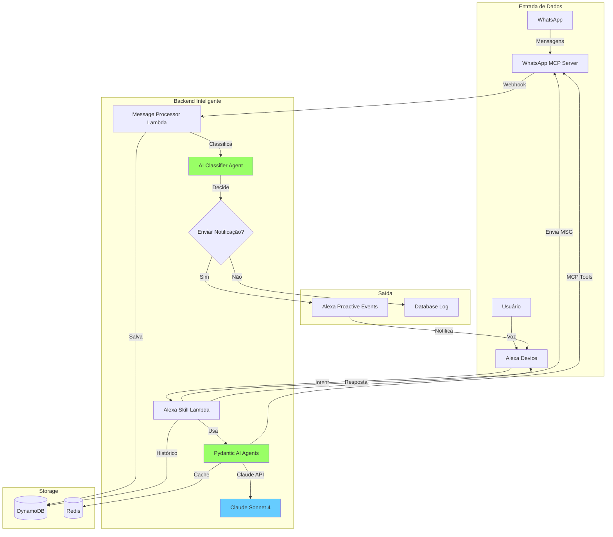
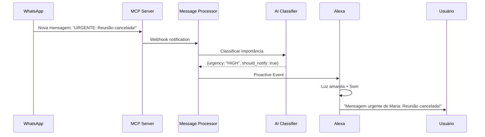
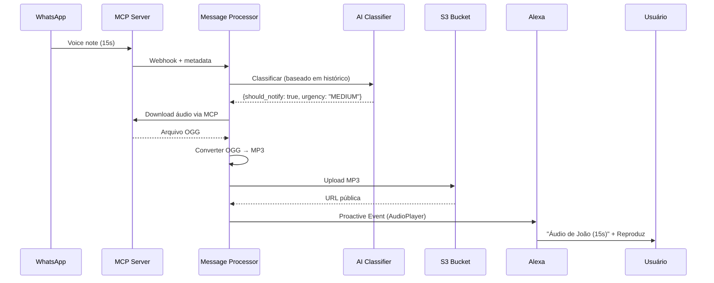
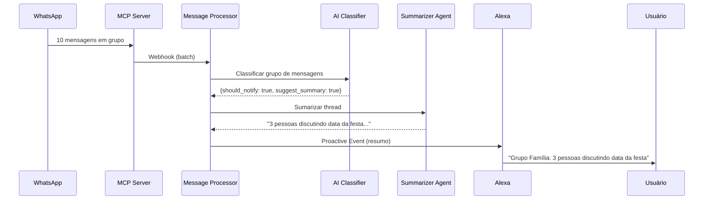
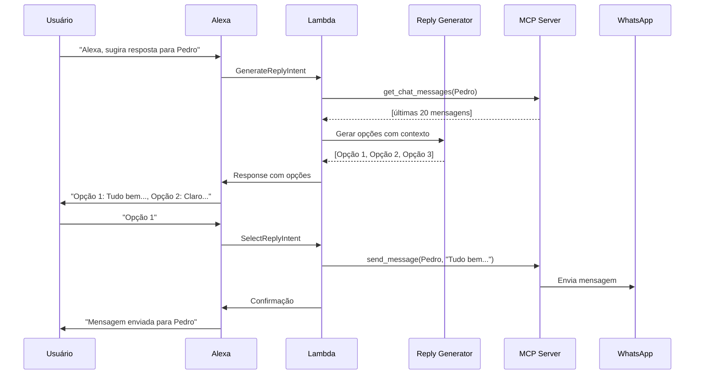
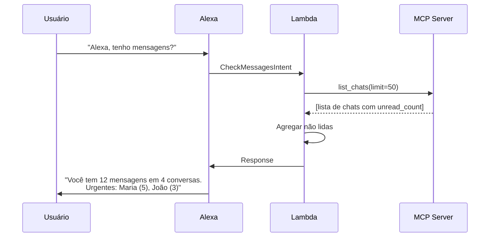
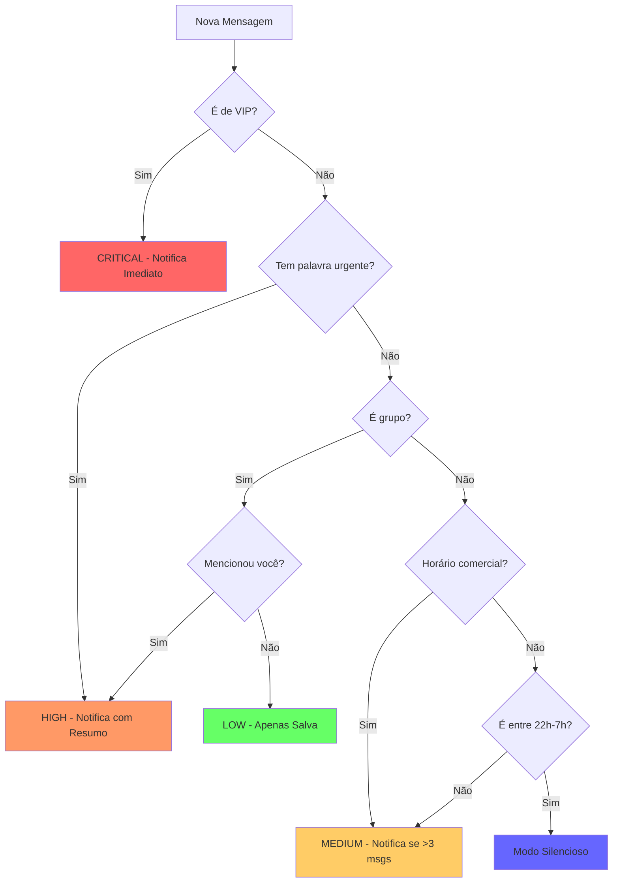

# Alexa WhatsApp Assistant

Documento gerado por IA, só pra lembrar dos pontos principais.

## 📋 Visão Geral

Um assistente inteligente que integra Alexa com WhatsApp, permitindo controle por voz de mensagens, notificações proativas inteligentes e uso de IA para gerar respostas contextuais.

## 🎯 Objetivos

1. **Controle por Voz**: Interagir com WhatsApp através de comandos de voz na Alexa
2. **Notificações Inteligentes**: Receber notificações proativas filtradas por IA
3. **Respostas Assistidas**: Gerar opções de resposta usando IA
4. **Sumarização**: Resumir conversas longas automaticamente
5. **Reprodução de Áudio**: Ouvir voice notes diretamente na Alexa

## 🏗️ Arquitetura


## 🧩 Componentes

### 1. [WhatsApp MCP Server](https://github.com/felipeadeildo/whatsapp-mcp)
- ✅ Servidor com conexão WhatsApp Web
- ✅ Endpoints MCP para tools
- ✅ Armazenamento SQLite local
- ✅ Suporte a mídia (imagens, áudios, documentos)

**Melhorias Necessárias:**
- [ ] Webhook para eventos de mensagem
- [ ] API REST para healthcheck

### 2. AI Classifier Agent
**Responsabilidade**: Decidir se/como notificar o usuário sobre novas mensagens
```python
class NotificationDecision(BaseModel):
    should_notify: bool
    urgency: Literal["LOW", "MEDIUM", "HIGH", "CRITICAL"]
    summary: str  # Se não notificar, salva resumo
    reason: str
    suggested_response: Optional[str]
```

**Regras de Classificação:**
- Contatos VIP → sempre notifica
- Palavras-chave urgentes → prioridade alta
- Mensagens longas → sumariza antes de notificar
- Spam/marketing → não notifica
- Contexto de conversa → analisa thread

### 3. Alexa Skill Handlers
Handlers para diferentes intents:

- `CheckMessagesIntent` - "Alexa, tenho mensagens?"
- `SummarizeConversationIntent` - "Alexa, resuma conversa com Maria"
- `ReadMessagesIntent` - "Alexa, leia mensagens de João"
- `GenerateReplyIntent` - "Alexa, sugira resposta para Pedro"
- `SendMessageIntent` - "Alexa, envie para Ana: ok, até amanhã"
- `PlayAudioIntent` - "Alexa, toque áudio de Carlos"

### 4. Pydantic AI Agents
Especializados em diferentes tarefas:
```python
# Agent 1: Sumarizador
summarizer_agent = Agent[WhatsAppDeps, ConversationSummary](
    'anthropic:claude-sonnet-4-5',
    output_type=ConversationSummary
)

# Agent 2: Gerador de Respostas
reply_generator_agent = Agent[WhatsAppDeps, list[ReplyOption]](
    'anthropic:claude-sonnet-4-5',
    output_type=list[ReplyOption]
)

# Agent 3: Classificador de Importância
importance_classifier_agent = Agent[WhatsAppDeps, NotificationDecision](
    'anthropic:claude-sonnet-4-5',
    output_type=NotificationDecision
)

# Agent 4: Analisador de Contexto
context_analyzer_agent = Agent[WhatsAppDeps, ConversationContext](
    'anthropic:claude-sonnet-4-5',
    output_type=ConversationContext
)
```

### 5. Message Processor
Lambda que processa mensagens recebidas:
```python
async def process_incoming_message(message: WhatsAppMessage):
    # 1. Classificar importância
    decision = await importance_classifier_agent.run(
        f"Classifique esta mensagem: {message.text}",
        deps=deps
    )
    
    # 2. Decidir ação
    if decision.should_notify:
        if decision.urgency == "CRITICAL":
            # Notificação imediata
            await send_proactive_notification(
                summary=message.text,  # mensagem crua
                urgency="HIGH"
            )
        elif decision.urgency == "HIGH":
            # Notificação com resumo
            summary = await summarizer_agent.run(...)
            await send_proactive_notification(
                summary=summary.output.summary,
                urgency="MEDIUM"
            )
        else:
            # Notificação silenciosa (só LED)
            await send_silent_notification()
    else:
        # Apenas salva no banco
        await save_to_database(message, decision.summary)
```

### 6. Audio Processor
Processa voice notes do WhatsApp:

- Download do áudio via MCP
- Conversão OGG → MP3 (compatível com Alexa)
- Upload para S3 com URL pública (maybe)
- Opcionalmente: transcrição com Whisper

### 7. Proactive Notification Service
Gerencia notificações da Alexa:
```python
class NotificationService:
    async def notify_text_message(
        self,
        sender: str,
        content: str,
        urgency: str
    )
    
    async def notify_audio_message(
        self,
        sender: str,
        audio_url: str,
        duration: int
    )
    
    async def notify_summary(
        self,
        summary: str,
        unread_count: int
    )
```

## 🔄 Fluxos Principais

### Fluxo 1: Mensagem de Texto Urgente Recebida


### Fluxo 2: Voice Note Recebido


### Fluxo 3: Conversação Longa Sumarizada


### Fluxo 4: Gerar e Enviar Resposta


### Fluxo 5: Verificação Manual de Status


## 📊 Regras de Classificação de Importância

### Matriz de Decisão


### Configuração de VIPs e Regras
```python
class UserPreferences(BaseModel):
    vip_contacts: list[str] = [
        "Mãe", "Pai", "Chefe", "Esposa"
    ]
    
    urgent_keywords: list[str] = [
        "urgente", "emergência", "ajuda", "socorro",
        "importante", "crítico", "ASAP"
    ]
    
    quiet_hours: dict = {
        "start": "22:00",
        "end": "07:00",
        "allow_vip": True  # VIPs podem notificar mesmo em quiet hours
    }
    
    group_preferences: dict = {
        "notify_on_mention": True,
        "notify_threshold": 5,  # notifica se >5 msgs não lidas
        "important_groups": ["Família", "Trabalho"]
    }
    
    summary_preferences: dict = {
        "long_message_threshold": 200,  # caracteres
        "auto_summarize_groups": True,
        "language": "pt-BR"
    }
```

## 🎨 Exemplos de Uso

### Cenário 1: Manhã Comum
```
[8:30 AM] WhatsApp: 15 mensagens noturnas
          ├─ Grupo Família (8): sumarizado
          ├─ João (5): não urgente
          └─ Spam (2): ignorado

Você: "Alexa, bom dia"
Alexa: "Bom dia! Você tem 13 mensagens em 3 conversas.
        Grupo Família está discutindo almoço de domingo.
        João te enviou 5 mensagens sobre o projeto."

Você: "Resuma o grupo Família"
Alexa: "8 mensagens: Mãe sugeriu churrasco domingo às 12h,
        todos confirmaram presença, seu irmão vai levar sobremesa."
```

### Cenário 2: Mensagem Urgente
```
[14:23] Maria: "URGENTE: Cliente cancelou reunião, 
                preciso remarcar AGORA"

[Alexa acende luz vermelha + som de notificação]

Alexa: "Mensagem urgente de Maria: Cliente cancelou reunião,
        preciso remarcar agora."

Você: "Alexa, responda para Maria"
Alexa: "Gerando opções... 
        Opção 1: Entendi, pode remarcar para amanhã mesmo horário.
        Opção 2: Ok, vou verificar minha agenda e te retorno em 5 min.
        Opção 3: Sem problemas, qual horário você sugere?
        Qual você prefere?"

Você: "Opção 2"
Alexa: "Mensagem enviada: Ok, vou verificar minha agenda..."
```

### Cenário 3: Voice Note
```
[19:45] Pedro: [🎤 Audio 23s]

[Alexa acende luz azul]

Alexa: "Áudio de Pedro, 23 segundos. Quer ouvir?"

Você: "Sim"
Alexa: [Reproduz áudio convertido]
       "E aí mano, conseguiu resolver aquele bug?
        Me chama quando puder..."

Você: "Alexa, responda com áudio... [você grava]"
[Funcionalidade futura - envio de áudio via Alexa]
```

### Cenário 4: Notificação Inteligente
```
[21:30] Grupo "Trabalho": 12 mensagens

AI Classifier:
├─ Horário: fora do comercial
├─ Grupo: não está em important_groups
├─ Urgência: palavras-chave encontradas = 0
└─ Decisão: Sumarizar + Notificação Silenciosa

[Alexa luz verde pulsando]

Você: "Alexa, o que foi?"
Alexa: "Grupo Trabalho: 12 mensagens.
        Resumo: Time discutindo deploy de amanhã às 9h,
        nenhuma ação necessária de você."
```

## 🚀 Fases de Implementação

### Fase 1: MVP - Notificações Básicas (2 semanas)
- [x] WhatsApp MCP Server funcionando
- [ ] Webhook para mensagens recebidas
- [ ] Lambda Message Processor básico
- [ ] Notificações proativas texto simples
- [ ] Intent CheckMessages

**Resultado**: Receber notificações de todas as mensagens na Alexa

### Fase 2: IA Classifier (2 semanas)
- [ ] Pydantic AI Agent para classificação
- [ ] Regras de VIP e urgência
- [ ] Quiet hours
- [ ] Filtro de spam
- [ ] DynamoDB para preferências

**Resultado**: Notificações inteligentes filtradas

### Fase 3: Sumarização (1 semana)
- [ ] Agent sumarizador
- [ ] Resumo de grupos
- [ ] Resumo de conversas longas
- [ ] Intent SummarizeConversation

**Resultado**: Receber resumos ao invés de mensagens brutas

### Fase 4: Respostas Assistidas (2 semanas)
- [ ] Agent gerador de respostas
- [ ] Context analyzer
- [ ] Intent GenerateReply
- [ ] Intent SendMessage
- [ ] Session management

**Resultado**: Gerar e enviar respostas por voz

### Fase 5: Áudio (1 semana)
- [ ] Audio processor
- [ ] Conversão OGG → MP3
- [ ] S3 storage
- [ ] Intent PlayAudio
- [ ] AudioPlayer directives

**Resultado**: Ouvir voice notes na Alexa

### Fase 6: Melhorias (Contínuo)
- [ ] Transcrição de áudios (Whisper)
- [ ] Envio de áudios pela Alexa
- [ ] Multi-idioma
- [ ] Analytics dashboard
- [ ] Mobile app para configs
- [ ] Integração com calendário

## 📦 Stack Tecnológica

### Backend
- **WhatsApp MCP Server**: Go + whatsmeow + SQLite
- **AI Agents**: Python + Pydantic AI + Claude Sonnet 4
- **Serverless**: AWS Lambda + API Gateway
- **Storage**: DynamoDB (preferências) + S3 (áudios)
- **Cache**: Redis (opcional, para respostas)

### Frontend
- **Alexa Skill**: Node.js / Python
- **Proactive Events**: Alexa Proactive Events API
- **Audio**: AudioPlayer Interface

### Infraestrutura
- **Deployment**: AWS CDK / Terraform
- **CI/CD**: GitHub Actions
- **Monitoring**: CloudWatch + Logfire
- **Secrets**: AWS Secrets Manager

## 💰 Custos Estimados (mensal)

- Claude API: ~$20-50 (dependendo do uso)
- AWS Lambda: ~$5
- DynamoDB: ~$2
- S3: ~$1
- API Gateway: ~$3
- Total: **~$30-60/mês**

## 🎯 Métricas de Sucesso

1. **Redução de Interrupções**: 70% menos notificações irrelevantes
2. **Tempo de Resposta**: 50% mais rápido com respostas assistidas
3. **Satisfação**: NPS > 8
4. **Precisão da IA**: >85% de classificações corretas
5. **Uptime**: >99.5%

## 🔒 Considerações de Segurança

- Credenciais no AWS Secrets Manager
- API Key do MCP em variáveis de ambiente
- Criptografia em trânsito (HTTPS)
- Criptografia em repouso (S3)
- Rate limiting em todos os endpoints
- Logs sem dados sensíveis (PII masking)

## 📝 Notas de Desenvolvimento

### Desafios Técnicos
1. **Latência**: Notificações devem ser <3s
2. **Contexto**: Manter contexto entre múltiplas interações
3. **Áudio**: Compatibilidade de formatos Alexa
4. **Classificação**: Evitar false positives/negatives
5. **Custos**: Otimizar chamadas à API Claude

### Otimizações Planejadas
- Cache de respostas comuns
- Batch processing de mensagens
- Lazy loading de histórico
- Compression de áudios
- Edge caching (CloudFront)
